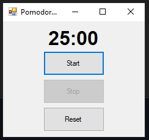

# Pomodoro Timer

A simple Pomodoro Timer built using C# WinForms. The timer helps you stay productive by working for 25 minutes and then taking short breaks, following the Pomodoro Technique.

## Features

- **Start Timer**: Start a 25-minute work session.
- **Pause Timer**: Pause the timer during the session.
- **Reset Timer**: Reset the timer back to 25 minutes.
- **Visual Countdown**: Displays the remaining time in the format `MM:SS`.
- **Automatic Stop**: The timer automatically stops when it reaches `00:00`.

## Screenshots



## How to Use

1. Download the repository and open the solution in **Visual Studio**.
2. Build the project and run the application.
3. Use the buttons to start, stop, and reset the timer.

## Installation

To install and run the Pomodoro Timer:

1. Clone the repository:
   ```bash
   git clone https://github.com/your-username/PomodoroTimer.git
